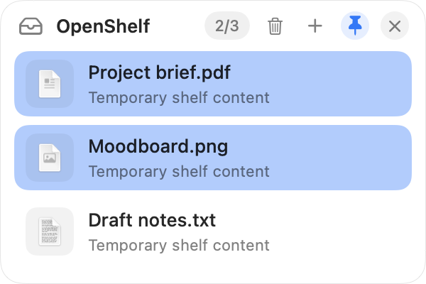
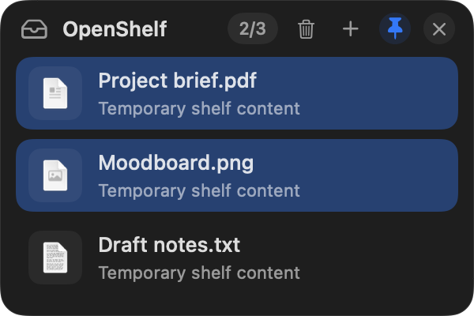
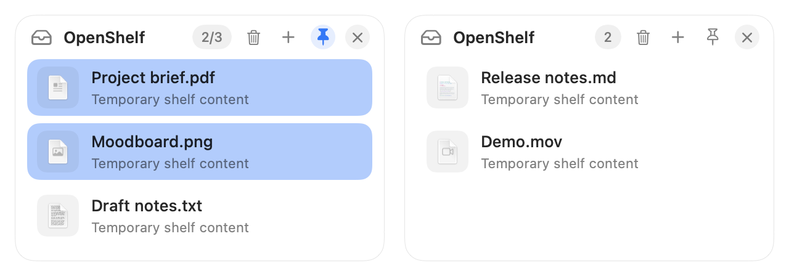

<p align="center">
  
</p>

<h1 align="center">OpenShelf</h1>

<p align="center"><strong>A little space between pick up and put down.</strong></p>
<p align="center">Native, open-source floating shelves for macOS. Collect. Arrange. Drop anywhere.</p>

<p align="center">
  <a href="https://github.com/brian4685380/OpenShelf/releases/latest"></a>
  <a href="https://github.com/brian4685380/OpenShelf/actions/workflows/ci.yml"></a>
  <a href="LICENSE"></a>
  
</p>

<p align="center">
  <a href="https://github.com/brian4685380/OpenShelf/releases/latest">Download</a> ·
  <a href="#install">Install</a> ·
  <a href="#multiple-shelves">Multiple shelves</a> ·
  <a href="#keyboard-first-too">Shortcuts</a> ·
  <a href="CHANGELOG.md">What's new</a> ·
  <a href="CONTRIBUTING.md">Contribute</a>
</p>

<p align="center">
  
  
</p>
<p align="center"><sub>Actual app views rendered with sample content. Light and dark appearance follow macOS.</sub></p>

## Your next move, within reach

Drag files to either screen edge to start a shelf. Drop more onto that shelf to collect them, or drag to the screen edge again to start another. Keep independent groups at hand, switch apps, then drag each group to its destination.

- **Room for separate workflows.** Keep multiple shelves open, each with its own files, selection, ordering, and pin state. Move groups between shelves without mixing the others.
- **More than files.** Collect folders, browser images, selected text, and links. Paste from the clipboard or send files from Terminal.
- **Familiar selection.** Command-click, Shift-click, or drag through blank space to select a group. Drag back to shrink the selection.
- **Your order.** Reorder rows and groups with an insertion guide and edge auto-scrolling. Continue past any shelf edge to drag files out.
- **There when you need it.** Available across windows, Desktops, and fullscreen apps. Collapse to an edge tab, or pin the shelf expanded.
- **Native and local.** SwiftUI + AppKit, adaptive appearance, accessible row actions, no account, analytics, or app-managed cloud uploads.

OpenShelf lives in the menu bar, not the Dock.

## Install

**macOS 13+ · Apple Silicon.** Intel users can build from source; the downloadable app and Homebrew cask currently target arm64.

### Homebrew

```sh
brew tap brian4685380/openshelf
brew install --cask openshelf
open /Applications/OpenShelf.app
```

The [Homebrew tap](https://github.com/brian4685380/homebrew-openshelf) also installs the `shelf` command.

To update, save any temporary clips and quit OpenShelf first; shelf contents are session-only. Then:

```sh
brew update
brew upgrade --cask openshelf
open /Applications/OpenShelf.app
```

### Direct download

Download the DMG from [the latest release](https://github.com/brian4685380/OpenShelf/releases/latest), open it, and drag **OpenShelf → Applications**. Launch the app from Applications.

> Releases are ad-hoc signed, **not Apple-notarized**. If macOS blocks the first launch, review [Apple's guidance](https://support.apple.com/102445). Only allow an app you trust through **System Settings → Privacy & Security → Open Anyway**. Do not disable Gatekeeper globally.

DMG users can install the optional command from **OpenShelf menu → Install CLI Tool…**. It creates a symlink in `/usr/local/bin` and asks for administrator approval. Homebrew users do not need this step.

## Multiple shelves

New in **v0.8.0**: keep independent collections open at the same time.

<p align="center">
  
</p>
<p align="center"><sub>Actual shelf views rendered side by side with sample content.</sub></p>

- Click **+** in a shelf header, choose **New Shelf** from the menu bar, or press **⌘N** while a shelf has focus.
- Every shelf uses the plain **OpenShelf** title and has its own contents, ordering, selection, and pin state. Shelves created with **+** use separate screen-edge positions when space is available; drag their headers to position them yourself.
- Drag files between shelves to transfer their entries. Temporary text/image clips get an independent copy so clearing the source shelf cannot break the destination.
- The **Shelves** menu lists every shelf with a preview of its first filename and marks the active one. Select a shelf there to reopen it. **×** hides a shelf without clearing it; **Remove Active Shelf…** removes it, with confirmation if it contains items.
- `shelf <files…>` adds to the last shelf you hovered over, clicked, dropped onto, created, or selected from the menu. Paste goes to the focused shelf. Drops go to the shelf under the pointer.
- Each new drag to the screen edge starts an empty shelf, even when another shelf is already on that edge. Existing shelves and their contents stay untouched; drop onto a visible shelf's content area to add to that shelf instead. Leaving and re-entering during the same drag reuses its preview, and a canceled empty preview is hidden for reuse.

All shelves remain session-only. Save temporary clips before quitting.

## Three ways in

1. **Drag:** reach either screen edge to start an empty shelf, or drop onto an existing shelf's content area to add to it.
2. **Paste:** hover over the shelf and press **⌘V**, or use **Paste from Clipboard** in an empty shelf.
3. **Terminal:**

   ```sh
   shelf ~/Desktop/report.pdf ~/Downloads/photos
   shelf "Design notes.txt"
   shelf -- -draft.txt
   ```

The CLI launches OpenShelf if necessary, validates all paths before sending, and waits for the app to confirm receipt. `shelf --help` shows usage and exit codes; `shelf --version` reports the version. After upgrading, restart the app so the CLI and running app match.

Requests use a private, short-lived local queue; notifications only wake the app. The shelf checks pending requests too, so a missed notification does not lose an addition. If the app cannot confirm receipt within five seconds, the CLI exits with an error rather than reporting success.

## Keyboard-first, too

Hover over the shelf to use its shortcuts. These are shelf-local, not global keyboard shortcuts.

| Shortcut | Action |
| --- | --- |
| ⌘N | New independent shelf |
| ↑ / ↓ | Select previous / next item; scroll it into view |
| ⇧↑ / ⇧↓ | Extend or shrink the selection |
| ⌘A | Select all |
| ⌘C | Copy selected files for pasting into Finder |
| ⌥⌘C | Copy selected paths |
| ⌘V | Add clipboard content |
| Space | Quick Look |
| Return / ⌘O | Open selected files |
| Delete | Remove selected entries from the shelf |
| ⌘P | Pin / unpin the expanded shelf |
| Escape | Clear selection; press again to close |

Right-click a row for group actions. Click blank shelf space to clear the selection. Use the pin button to keep an empty or populated shelf expanded; the close button always works. Shortcut help is also available in the menu bar.

## What happens to my files?

- Files and folders are **references to originals**. Removing an entry or clearing the shelf does not delete those originals.
- Imported text, images, and web links become temporary local files. Save anything you want to keep before removing it.
- Temporary content copied or dragged out is kept until OpenShelf quits, so a destination has time to read it even after its shelf entry disappears.
- A successful drag to another app removes those entries from the shelf. The destination determines whether the underlying file is copied or moved.
- Shelf contents and pin state are **session-only**; they are not restored after quitting. This is a temporary staging area, not a backup.
- Missing originals are automatically removed from the list. OpenShelf does not monitor the clipboard continuously; it reads it when you paste.

## Build and contribute

A macOS machine and a Swift 5.9+ toolchain / Xcode Command Line Tools are required.

```sh
git clone https://github.com/brian4685380/OpenShelf.git
cd OpenShelf
swift run OpenShelf
```

Quit any installed OpenShelf instance before running a development build.

```sh
swift test
swift build -c release
./scripts/package_app.sh
```

See [Contributing](CONTRIBUTING.md) for architecture, regression tests, and screenshot generation; [Releasing](docs/releasing.md) for packaging and Homebrew publication.

Found a bug? [Open a report](https://github.com/brian4685380/OpenShelf/issues/new/choose) with the app version, macOS version, display setup, and reproduction steps. Please redact private file paths from logs.

## Project

Built by [Brian Yuan](https://github.com/brian4685380) and contributors. Inspired by the file-shelf workflow popularized by apps such as Dropover and DropShelf; OpenShelf is an independent project.

Near-term priorities: Developer ID signing and notarization, optional session restoration, and broader accessibility testing. Contributions that preserve a lightweight, predictable shelf are welcome.

[MIT License](LICENSE) · [Security](SECURITY.md) · [Changelog](CHANGELOG.md)
